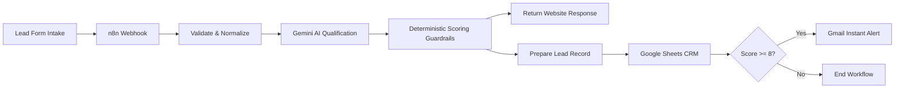

# LeadPilot AI · Intelligent Lead Intake & Qualification

Autonomous AI lead intake, qualification, and routing automation engineered for fast-moving sales and service businesses.

**Live Production Demo:** [https://leadpilot-ai-web-xi.vercel.app/](https://leadpilot-ai-web-xi.vercel.app/)  
**GitHub Repository:** [https://github.com/habiblne/leadpilot-ai](https://github.com/habiblne/leadpilot-ai)

---

## Overview

LeadPilot AI bridges the gap between customer web inquiries and sales operations. When a lead submits a form:
1. The request is ingested and normalized via a production **n8n webhook**.
2. **Google Gemini 1.5** performs deep semantic qualification (purchase intent, timeline urgency, budget fit, and rationale).
3. Deterministic **business scoring guardrails** eliminate AI hallucination, calculating a standardized 0–10 score and temperature classification (**HOT**, **WARM**, **COLD**).
4. The frontend receives the qualified response in sub-second latency via an asynchronous dual-branch architecture.
5. Inquiries are automatically appended to a **Google Sheets CRM database**, and **HOT leads (Score &ge; 8)** trigger instant **Gmail alerts** to the sales team with a pre-drafted reply.

---

## Problem & Solution

### The Inbound Bottleneck
- High-intent, ready-to-buy prospects wait hours or days for a response, dropping deal conversion rates.
- Sales teams waste precious hours manually reading, filtering, and organizing unqualified inquiries.
- Inconsistent qualification criteria lead to missed opportunities and scattered spreadsheets.

### The LeadPilot Solution
LeadPilot AI converts unstructured customer text into prioritized, structured business intelligence in real time.



---

## Modernized Frontend Experience

The user interface has been elevated into a sleek, modern AI SaaS landing page and interactive live demo:

- **Ambient Glassmorphic Aesthetic:** Deep obsidian/slate dark theme with ambient lighting, glowing brand elements, and crisp typography (`Plus Jakarta Sans`).
- **Interactive Lead Playground:** Two-column fluid layout with live production webhook connectivity indicator.
- **One-Click Test Presets:**
  - **🔥 Hot Lead:** Urgent 7-day e-commerce automation inquiry with 120,000 DZD budget.
  - **⚡ Warm Lead:** Digital agency exploring lead filtering options for next quarter.
  - **❄️ Cold Lead:** Casual inquiry with vague requirements and zero budget.
  - **Clear/Reset:** Quick reset for custom lead testing.
- **Dynamic AI Stepper:** Visual real-time 3-stage progress indicator during submission (`Normalizing Input` &rarr; `Gemini Intent Extraction` &rarr; `Scoring Guardrails & Storage`).
- **Executive Intelligence Dashboard:**
  - Dynamic Score Gauge (`0–10`) with glowing temperature badge (Emerald for **HOT**, Amber for **WARM**, Slate for **COLD**).
  - 4-Factor Evaluation Chips: Priority, Intent, Urgency, and Budget Fit.
  - Qualification Rationale and Recommended Next Action.
  - **1-Click Copy Suggested Reply:** Pre-drafted personalized response ready for email or WhatsApp follow-up.
  - **Raw JSON Schema Toggle:** Instant view toggle between the executive presentation and the raw API payload for technical evaluators.
- **Visual Pipeline Architecture:** Interactive 5-step workflow section illustrating data flow and security guarantees.

---

## Qualification Schema

The automation returns structured, production-ready lead intelligence:

```json
{
  "score": 10,
  "temperature": "hot",
  "purchaseIntent": "high",
  "urgency": "high",
  "budgetFit": "strong",
  "summary": "Lead is requesting AI automation for a clothing store.",
  "qualificationReason": "Clear business need, strong budget and immediate timeline.",
  "recommendedAction": "Call the lead immediately.",
  "suggestedReply": "Hello Ahmed, thank you for reaching out..."
}
```

---

## Scoring Logic & Deterministic Guardrails

While Gemini handles semantic understanding, deterministic business logic controls routing:

- `8–10` &rarr; **HOT** (Triggers instant Gmail notification + Google Sheets record)
- `5–7` &rarr; **WARM** (Logged to Google Sheets CRM for nurture campaign)
- `0–4` &rarr; **COLD** (Logged to Google Sheets CRM for audit)

### Guardrail Rule
If all three primary intent signals are high:
```text
purchaseIntent = high
urgency = high
budgetFit = strong
```
The final score is guaranteed to be at least `8`, ensuring reliable routing even with natural LLM variance.

---

## Tech Stack

| Component | Technology | Role |
|---|---|---|
| **Workflow Orchestration** | [n8n](https://n8n.io) | Webhook intake, data validation, dual-branch routing |
| **AI Engine** | [Google Gemini 1.5](https://deepmind.google/technologies/gemini/) | Intent analysis, timeline extraction, reply drafting |
| **CRM Database** | [Google Sheets](https://sheets.google.com) | 17-field lead database & audit log |
| **Alerting** | [Gmail API](https://developers.google.com/gmail/api) | Real-time email dispatch for HOT leads |
| **Frontend** | HTML5, Modern CSS, Vanilla JS | Zero-build, fast, responsive static web app |
| **Hosting & CI/CD** | [Vercel](https://vercel.com) | Edge delivery, automated git-triggered deployments |

---

## Project Structure

```text
leadpilot-ai-web/
├── index.html        # Modern landing page, interactive playground, and architecture visualizer
├── styles.css        # Responsive design system, glassmorphism, animations, dark mode
├── app.js            # Lead submission, preset autofill, dynamic stepper, copy-to-clipboard
├── config.js         # Production n8n webhook endpoint configuration
├── vercel.json       # Vercel security headers and clean URL configuration
└── README.md         # Architecture, deployment, and technical documentation
```

---

## Local Development & Setup

1. **Clone the repository:**
   ```bash
   git clone https://github.com/habiblne/leadpilot-ai.git
   cd leadpilot-ai
   ```

2. **Configure Webhook Endpoint (if running your own n8n instance):**
   Edit `config.js`:
   ```javascript
   window.LEADPILOT_CONFIG = {
     webhookUrl: 'https://your-n8n-domain/webhook/your-endpoint',
   };
   ```

3. **Run locally:**
   Open `index.html` directly in any modern browser, or serve with any local static server:
   ```bash
   npx serve .
   # or
   python -m http.server 3000
   ```

---

## Deployment to Vercel

### Option 1: Automatic Deployment via GitHub (Recommended)
This repository is pre-configured for zero-config deployment on Vercel:
1. Push your changes to the `main` branch:
   ```bash
   git push origin main
   ```
2. Vercel automatically detects the push, deploys the static files, and applies the security headers defined in `vercel.json`.

### Option 2: Deploy via Vercel CLI
```bash
npx vercel --prod
```

---

## Security & Reliability Guarantees

- **Zero Client-Side Secrets:** Gemini API keys, Google Sheets OAuth tokens, and Gmail credentials reside exclusively in secured n8n environment variables.
- **Dual-Branch Execution:** Customer-facing webhook responses return immediately; Sheets logging and email notifications execute in parallel.
- **Security Headers:** `vercel.json` applies `X-Content-Type-Options: nosniff`, strict referrer policy, and restrictive permissions policies.

---

## Status

**Production-Ready MVP:** Live, integrated end-to-end, tested across real lead submissions, and deployed to Vercel.
