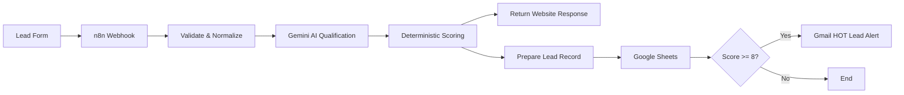

# LeadPilot AI

AI-powered lead intake and qualification automation for small businesses.

**Live demo:** https://leadpilot-ai-web-xi.vercel.app/

## Overview

LeadPilot AI receives an incoming lead from a web form, validates the data, uses Gemini to understand the request, applies deterministic business scoring, stores the lead in Google Sheets, and sends an instant Gmail alert when the lead is HOT.

The customer-facing webhook response stays fast because storage and notification run on a separate branch after qualification.

## Problem

Businesses often receive leads through forms, ads, social media, or landing pages but still review every request manually. This creates three common problems:

- high-intent leads can get buried in the inbox;
- sales teams spend time reading low-quality inquiries;
- follow-up is inconsistent and slow.

LeadPilot AI turns raw inquiries into structured, prioritized leads automatically.

## Solution

A submitted lead is processed through this pipeline:



## Core Features

- Responsive lead intake form
- Production n8n webhook
- Input validation and normalization
- Gemini-powered lead understanding
- Structured qualification output
- Lead score from 0 to 10
- HOT / WARM / COLD classification
- Deterministic scoring guardrails
- Google Sheets lead database
- Gmail notification for HOT leads only
- Suggested reply generated for sales follow-up
- Error-safe storage and notification branch
- No API keys exposed in the frontend

## Qualification Output

The automation produces structured information such as:

```json
{
  "score": 10,
  "temperature": "hot",
  "purchaseIntent": "high",
  "urgency": "high",
  "budgetFit": "strong",
  "summary": "Lead is requesting AI automation for a clothing store.",
  "qualificationReason": "Clear business need, strong budget and immediate timeline.",
  "recommendedAction": "Call the lead immediately.",
  "suggestedReply": "Hello Ahmed, thank you for reaching out..."
}
```

## Scoring Logic

Gemini analyzes the lead, but it does **not** control the final classification by itself.

Business rules are applied after the AI response:

- `8–10` → **HOT**
- `5–7` → **WARM**
- `0–4` → **COLD**

Additional guardrail:

If all three signals are present:

```text
purchaseIntent = high
urgency = high
budgetFit = strong
```

the final score is forced to at least `8`.

This keeps routing consistent even when the LLM output varies.

## Workflow Design

After the final qualification result, the workflow splits into two branches.

### Branch A — Fast customer response

```text
Build Final Result
→ Return AI Qualification
```

The website receives its response immediately.

### Branch B — Business operations

```text
Build Final Result
→ Prepare Lead Record
→ Google Sheets
→ Is HOT Lead?
→ Gmail notification when score >= 8
```

Google Sheets or Gmail failures are configured not to break the website response.

## Google Sheets Record

Every lead is flattened into these fields:

```text
receivedAt
name
phone
business
service
budget
message
score
temperature
purchaseIntent
urgency
budgetFit
summary
qualificationReason
recommendedAction
suggestedReply
source
```

## Tech Stack

- **n8n** — workflow orchestration
- **Google Gemini** — lead understanding and qualification
- **Google Sheets** — lead storage
- **Gmail** — HOT lead notifications
- **HTML / CSS / JavaScript** — frontend
- **Vercel** — frontend deployment

## Production Setup

Frontend production webhook:

```text
https://abdou213.app.n8n.cloud/webhook/leadpilot-intake-v21
```

The frontend endpoint is configured in `config.js`.

Secrets and OAuth credentials remain inside n8n. The public frontend contains no Gemini, Google Sheets, or Gmail credentials.

## Project Structure

```text
leadpilot-ai-web/
├── index.html
├── styles.css
├── app.js
├── config.js
├── vercel.json
├── README.md
├── PORTFOLIO_CASE_STUDY.md
└── DEMO_SCRIPT.md
```

## Validation

The production workflow was tested end-to-end with real integrations.

### HOT lead

- Gemini executed successfully
- Final score: `10/10`
- Temperature: `HOT`
- Google Sheets row appended successfully
- `score >= 8` routed to TRUE
- Real Gmail notification sent
- Website response returned normally

### Low-priority leads

COLD test leads were stored without triggering Gmail, confirming that only HOT leads enter the notification branch.

## Business Value

LeadPilot AI helps a business:

- identify the best prospects faster;
- reduce manual lead review;
- prioritize follow-up;
- keep lead data organized;
- generate a useful first reply;
- react immediately to high-intent opportunities.

The same architecture can be adapted for real estate agencies, marketing agencies, private schools, service businesses, gyms, B2B companies, and other businesses that receive inbound leads.

## Status

**Production MVP complete.**

The core workflow has been built, tested with real integrations, published in n8n, and connected to a live Vercel frontend.
