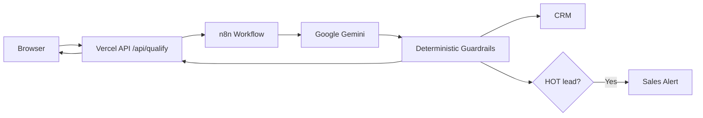

# LeadPilot AI · Intelligent Lead Intake & Qualification

LeadPilot AI is a client-facing lead intake application that turns unstructured inquiries into prioritized sales intelligence. It combines Google Gemini attribute extraction with deterministic scoring and routing rules orchestrated in n8n.

**Live demo:** [leadpilot-ai-web-xi.vercel.app](https://leadpilot-ai-web-xi.vercel.app/)
**Repository:** [github.com/habiblne/leadpilot-ai](https://github.com/habiblne/leadpilot-ai)

## Overview

Inbound leads often wait while sales teams manually read messages, estimate intent, and copy details into a CRM. LeadPilot gives prospects an immediate qualification experience while producing consistent, structured data for the sales workflow.

The AI layer extracts purchase intent, urgency, budget fit, a rationale, and a suggested reply. Deterministic application rules—not the language model—control the final score, HOT/WARM/COLD classification, CRM routing, and alert behavior. These guardrails reduce model-driven scoring variance but do not guarantee that every AI-extracted attribute is correct.

## Architecture



The browser sends only to the same-origin API. The server validates and allowlists fields, applies basic abuse controls, adds a request ID, and forwards the sanitized payload to n8n using a server-only webhook URL. The exact Gemini model is controlled by the external n8n workflow and is therefore intentionally described here as Google Gemini.

## Key Features

- Dark glassmorphism UI using Plus Jakarta Sans
- HOT, WARM, and COLD test presets
- Three-phase execution stepper
- 0–10 score gauge and qualification metrics
- Qualification rationale, recommended action, and suggested reply
- Copy-to-clipboard actions and dashboard/raw JSON views
- Responsive and accessible status handling
- Same-origin server-side proxy for the n8n integration
- Request IDs, duplicate-submit protection, upstream timeout handling, and structured server logs
- Strict input and n8n response validation without extra runtime dependencies

## Qualification Contract

The validated API response uses this canonical shape:

```json
{
  "success": true,
  "requestId": "123e4567-e89b-12d3-a456-426614174000",
  "message": "Lead qualified successfully.",
  "qualification": {
    "score": 8,
    "temperature": "hot",
    "purchaseIntent": "high",
    "urgency": "high",
    "budgetFit": "strong",
    "summary": "Lead summary",
    "qualificationReason": "Qualification rationale",
    "recommendedAction": "Recommended next step",
    "suggestedReply": "Draft response"
  }
}
```

Supported classifications are:

- Priority: `hot`, `warm`, `cold`
- Intent: `high`, `medium`, `low`
- Urgency: `high`, `medium`, `low`
- Budget fit: `strong`, `moderate`, `weak`
- Score: numeric value from 0 through 10

Unknown categories or malformed upstream data return a clean `INVALID_UPSTREAM_RESPONSE` error and are not rendered as fabricated qualification results.

## Deterministic Scoring Guardrails

The expected business ranges are:

- `0–4` → `COLD`
- `5–7` → `WARM`
- `8–10` → `HOT`

If it matches the current business policy, n8n should enforce a minimum HOT score when intent is high, urgency is high, and budget fit is strong. Keep this logic in deterministic Code/IF nodes rather than delegating the final routing decision to Gemini.

## Security Model

- The browser never receives the production n8n webhook URL or shared secret.
- `/api/qualify` reads `N8N_WEBHOOK_URL` and `N8N_WEBHOOK_SECRET` only on the server and fails closed when either is missing or invalid.
- Payloads are limited to 16 KiB, must be JSON, and are rebuilt from an explicit field allowlist.
- Required fields, types, lengths, phone shape, request IDs, and response categories are validated.
- Nested/prototype-pollution-style input is rejected and unexpected properties are removed.
- A honeypot, minimum completion time, and per-instance request limit reduce basic demo abuse.
- Security headers include a compatible CSP, frame protection, MIME sniffing protection, HSTS, referrer policy, and a restrictive permissions policy.
- Logs contain correlation and operational metadata, not secrets or full lead messages.

The bundled rate limiter and idempotency cache are intentionally best-effort, per-instance protections because Vercel functions can run on multiple short-lived instances. They are not distributed rate limiting or DDoS protection. Public production should use Upstash Redis, a Vercel-compatible Redis/KV service, or another shared datastore for rate limiting, plus durable workflow-side idempotency.

## Reliability

- The client disables submission while a request is active and reuses a request ID for the same form content.
- The API coalesces concurrent requests and replays successful results for the same ID on a warm instance.
- n8n calls have a 20-second timeout and no automatic retry, avoiding accidental duplicate side effects.
- Network failures, upstream 4xx/5xx responses, invalid JSON, and invalid qualification schemas map to consistent public errors.
- Both server and browser validate the response before the dashboard renders it.
- Structured Vercel logs include request ID, timestamp, upstream status, duration, outcome, and error code.

## Health Check

`GET /api/health` returns only readiness state and two configuration booleans. It never returns the webhook URL or secret. HTTP `200` with `status: "ok"` means both server variables pass local configuration validation; HTTP `503` means the deployment is not ready. This does not prove that n8n accepted the secret or that downstream workflow nodes work.

## Environment Variables

Copy `.env.example` when working locally. Never commit the populated file.

```dotenv
N8N_WEBHOOK_URL=
N8N_WEBHOOK_SECRET=
```

Both values are required. The secret must contain at least 32 characters; the recommended generator below produces a 64-character hexadecimal value. Use the same secret in Vercel and n8n, never use a `NEXT_PUBLIC_`, `VITE_`, or other public prefix, and rotate it if exposed.

## Local Development

Node.js 20 or newer is required for the test and verification scripts.

PowerShell:

```powershell
Copy-Item .env.example .env.local
```

Bash-compatible shells:

```bash
cp .env.example .env.local
```

Generate a strong secret locally:

```bash
node -e "console.log(require('crypto').randomBytes(32).toString('hex'))"
```

Put the n8n URL and the same generated secret used by n8n into `.env.local`, then run:

```bash
npm install
npm test
npm run build
npx vercel dev
```

Opening `index.html` directly can display the UI, but API submissions require the Vercel development server. For a linked Vercel project, `npx vercel pull` is the supported alternative for fetching Development project settings; `.vercel/` is ignored by Git.

## Production Deployment

1. Open the LeadPilot project in the Vercel dashboard.
2. Go to **Settings → Environment Variables**.
3. Add `N8N_WEBHOOK_URL` and select **Production**.
4. Add `N8N_WEBHOOK_SECRET` as a sensitive value and select **Production**.
5. Add both variables to **Preview** only when previews should call an isolated test workflow; do not point untrusted previews at production CRM/alerts.
6. Add Development values only when needed for `vercel dev`.
7. Save the variables and redeploy. Environment-variable changes apply only to new deployments, as described in [Vercel's environment-variable documentation](https://vercel.com/docs/environment-variables/managing-environment-variables).
8. Verify `GET /api/health` returns HTTP `200` without exposing values.
9. Run the controlled checklist in [docs/PRODUCTION_TEST_PLAN.md](docs/PRODUCTION_TEST_PLAN.md), correlate each `requestId`, and verify exactly one CRM row/alert where expected.

Vercel serves the static assets and files under `api/` as Node serverless functions; no compiled frontend bundle is produced.

## n8n Requirements

The workflow is external to this repository, so it was not modified here. Before production rollout:

- Configure the Webhook trigger's native Header Auth credential with header name `X-LeadPilot-Secret` so unauthorized requests are rejected before workflow nodes run.
- Deduplicate all CRM writes and alerts by `requestId` using durable storage.
- Return the documented strict JSON response schema.
- Keep final scoring and routing deterministic.
- Configure an Error Workflow and monitored failure alerts.
- Apply safe, bounded retries only to idempotent operations.

See [docs/N8N_PRODUCTION_CHECKLIST.md](docs/N8N_PRODUCTION_CHECKLIST.md) for concrete implementation guidance.

## Future Roadmap

- WhatsApp Cloud API intake and approved-message follow-up
- Meta/Facebook Lead Ads ingestion
- Native HubSpot, Pipedrive, and GoHighLevel destinations
- Round-robin sales assignment with availability rules
- Automated, consent-aware follow-up sequences
- Funnel, response-time, qualification, and conversion analytics

## Project Structure

```text
leadpilot-ai-web/
├── api/qualify.js                  # Vercel server-side n8n proxy
├── api/health.js                   # Non-sensitive readiness endpoint
├── docs/N8N_PRODUCTION_CHECKLIST.md
├── docs/PRODUCTION_TEST_PLAN.md
├── lib/input-validation.js         # Input allowlist and validation
├── lib/server-config.js            # Fail-closed server configuration
├── scripts/verify-build.js         # Zero-build artifact verification
├── shared/qualification.js         # Server/browser response normalizer
├── test/                            # Node built-in tests
├── index.html
├── styles.css
├── app.js
├── vercel.json
└── .env.example
```

## Remaining Production Considerations

The former production n8n webhook URL is present in Git history. Deleting the browser configuration file does not erase that history: rotate the n8n webhook path before testing and retire the old URL. No committed shared-secret value was found in the current audit.

For a higher-volume or multi-tenant deployment, add distributed rate limiting, durable database idempotency, bot challenges where abuse warrants them, authenticated operator access to raw lead intelligence, and centralized monitoring with alert thresholds.
